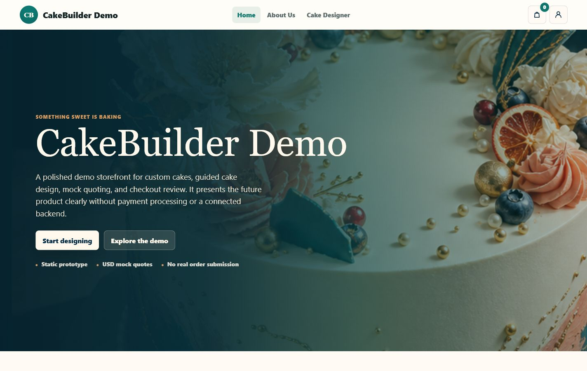
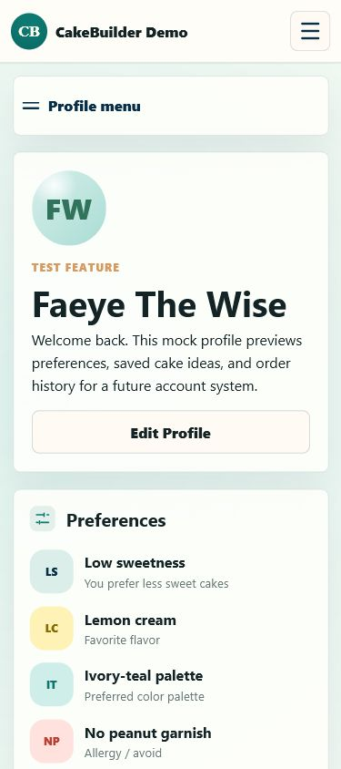

# CakeBuilder Demo

> A polished, mobile-first bakery ordering template for custom cake demos, mock ecommerce flows, and portfolio presentations.

**CakeBuilder Demo is a free static website template.** Use it as a starting point for school projects, client mockups, design demos, or frontend experiments. It includes no backend, no real payments, and no real order submission.



## Preview

| Desktop | Mobile |
| --- | --- |
|  |  |

## What Is Included

- Modern responsive homepage with full-bleed cake hero
- Guided cake designer with 3D preview and preset decoration logic
- Multi-step mock checkout flow
- Contact, delivery, review, payment, and confirmation steps
- Sticky desktop order summary and expandable mobile order summary
- Mock profile dashboard with saved preferences, saved designs, and order history
- Local storage demo state for cart, saved designs, checkout progress, and mock orders
- USD-only mock pricing and prep-time estimates
- Docker-friendly static hosting setup

## Free Template Notice

This project is intended as a **free template** and static prototype. You can fork it, remix it, restyle it, and use it as a base for demos. Before using it for a real business, add your own branding, copy, product images, legal pages, backend, checkout provider, privacy policy, and production security review.

## Tech Stack

- HTML
- CSS
- Vanilla JavaScript
- Three.js for the cake preview
- LocalStorage for demo-only state
- Docker / Nginx static serving

## Pages

- `index.html` - homepage and product overview
- `builder.html` - guided cake designer
- `checkout.html` - multi-step checkout experience
- `profile.html` - mock customer profile dashboard

## Run Locally

From the project folder:

```powershell
python -m http.server 5173
```

Then open:

```text
http://localhost:5173
```

## Docker

```powershell
docker build -t cakebuilder-demo .
docker run --rm -p 8080:80 cakebuilder-demo
```

Then open:

```text
http://localhost:8080
```

## Deploy For Free

Because this is a static template, it can be hosted on free/static platforms such as:

- GitHub Pages
- Netlify
- Vercel
- Cloudflare Pages
- Render static hosting

Use the project root as the publish directory.

## Demo Limitations

- No backend
- No user authentication
- No real payment processing
- No real order submission
- No email notifications
- No database

The checkout and profile flows are intentionally mock implementations so future backend or payment integrations can be added later.

## Suggested Customization

- Replace the placeholder cake imagery with real bakery photos
- Update brand name, logo, colors, and typography
- Connect checkout to a real payment provider
- Add a backend for orders and customer accounts
- Replace mock localStorage data with API calls
- Add a real receipt and order management workflow

## Project Status

Static frontend demo / free template. Ready for presentation, remixing, and further development.
